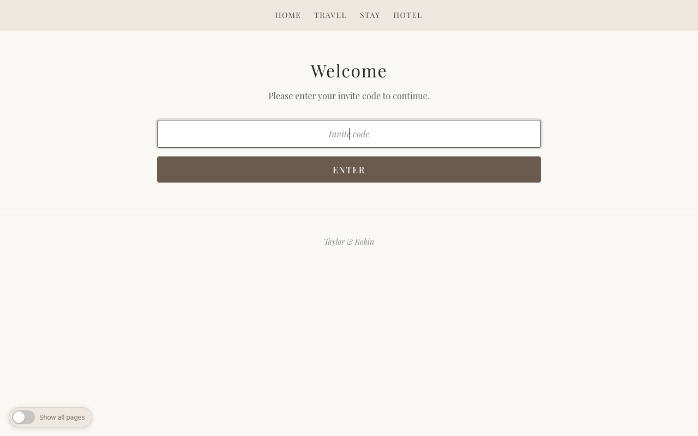
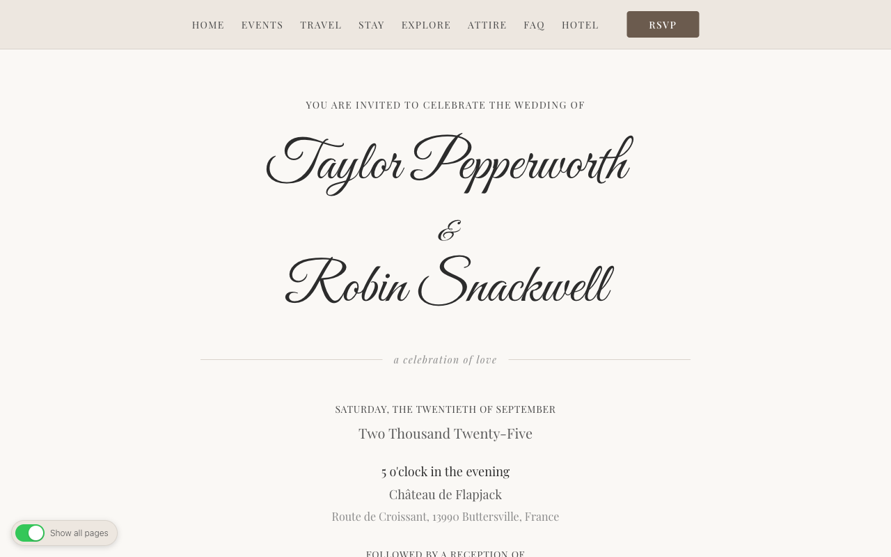
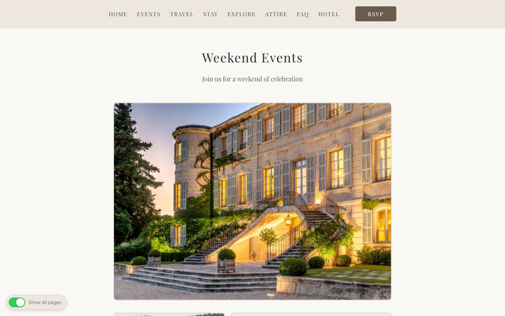
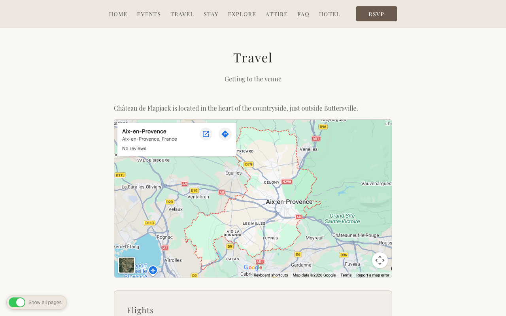
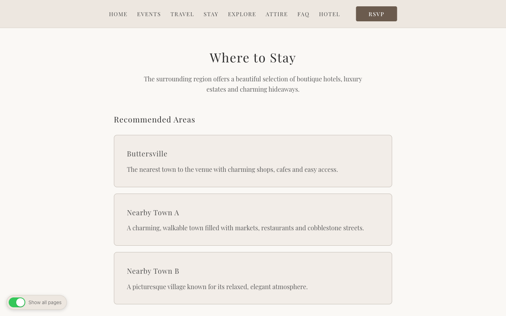
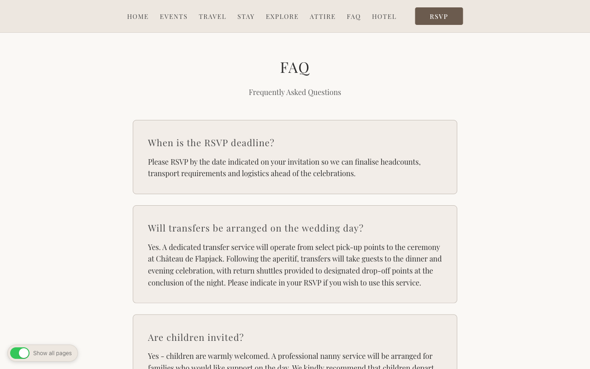
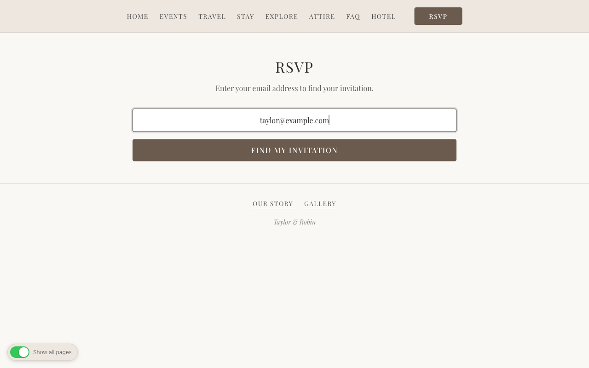
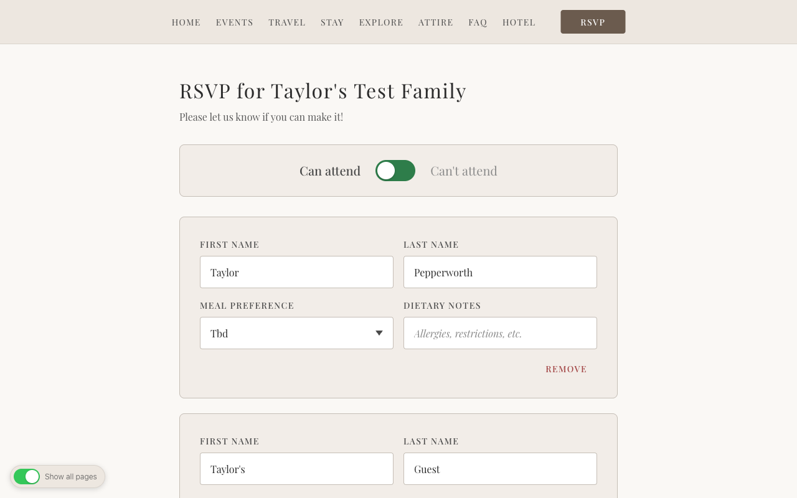
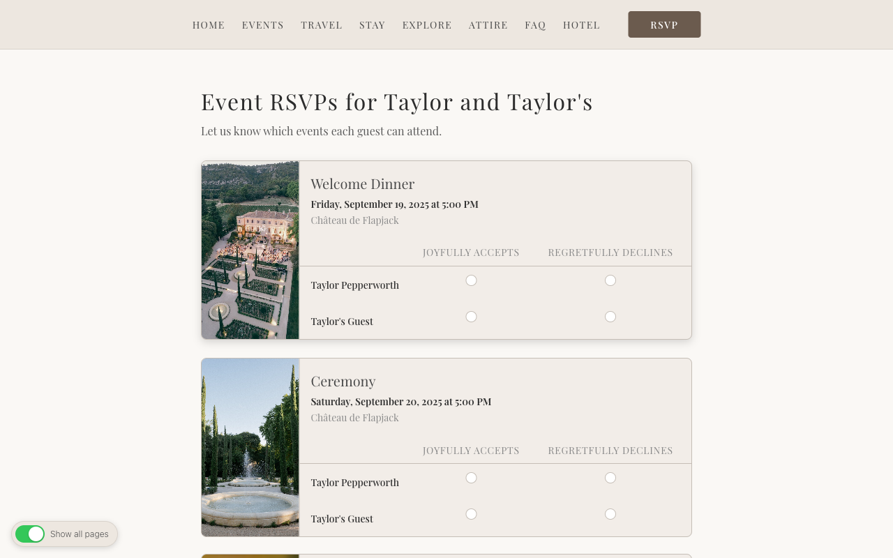

# Git Hitched

A complete, self-hosted wedding website you can fork and make your own. Handles everything from save-the-dates to day-of logistics: a gated site with a shared invite code, household-based RSVPs across multiple events, meal and dietary tracking, childcare coordination, hotel room blocks with Stripe checkout, automated email notifications, and a full admin dashboard to manage it all. Built with Ruby on Rails 8, Hotwire, Tailwind CSS, and [Claude Code](https://claude.ai/claude-code).

## Features at a Glance

- **Site gate** — Visitors enter a shared invite code before seeing anything. One password for the whole site, set via environment variable.
- **Multi-step RSVP** — Guests look up their invite by email, manage their party (add/remove guests, mark children, request childcare), RSVP per-event, choose meals, leave notes, and get a confirmation page.
- **Household model** — Invites represent a household, not an individual. One invite can have multiple guests, and each guest RSVPs independently to each event.
- **Multi-event support** — Define as many events as you need (welcome dinner, ceremony, reception, recovery brunch, etc.). Not every household has to be invited to every event.
- **Meal & dietary tracking** — Each guest picks from configurable meal choices (chicken, fish, vegetarian, vegan) with a free-text dietary notes field.
- **Children & childcare** — Track which guests are children, their ages, and whether they need childcare. Dashboard shows totals.
- **Hotel room block with Stripe** — Guests can book hotel rooms and pay via Stripe Checkout. Admins can view bookings, track revenue, and issue refunds — all from the admin panel.
- **Automated emails** — Four RSVP email types (invitation, confirmation, update notification, reminder) plus three hotel booking emails (confirmation, admin notification, refund). All include signed token links so guests can manage their RSVP without logging in.
- **Admin dashboard** — Response rates, per-event attendance breakdowns, meal choice counts, children/childcare stats, bulk email sending, CSV import from Google Sheets, and hotel booking management.
- **Page feature flags** — Show or hide any content page (events, travel, stay, FAQ, etc.) from a single YAML file. Flip pages on as you're ready — no deploys needed in development.
- **Dev mode toggle** — A floating switch in development that shows all pages regardless of feature flags, so you can work on hidden pages without editing config.

## Screenshots

### Gate


### Home


### Events


### Travel


### Stay


### FAQ


### RSVP Lookup


### RSVP Guest Details


### RSVP Event Selection


## Stack

- Ruby 3.3 / Rails 8.0
- PostgreSQL
- Tailwind CSS
- Hotwire (Turbo + Stimulus)
- Stripe (hotel room payments)

## Quick Start

```bash
bundle install
bin/rails db:create db:migrate db:seed
bin/dev
```

Visit `http://localhost:3000`. The default gate code is `SOLSTICE`.

Admin panel is at `/admin` (default credentials: `admin` / `password`).

## How It Works

### The Gate

Every page on the site (except the admin panel and Stripe webhooks) is behind a gate. Visitors enter a shared invite code — think of it as a lightweight password for the whole site. The code is set via the `WEDDING_INVITE_CODE` environment variable (default: `SOLSTICE`). Once entered, it's stored in the session and the visitor can browse freely.

### RSVP Flow

The RSVP process is a multi-step form designed for households, not individuals:

1. **Lookup** — Guest enters their email at `/rsvp`. The system finds their invite (case-insensitive).
2. **Manage guests** — The primary guest sees everyone in their household. They can edit names, add or remove additional guests, mark children, set ages, and request childcare.
3. **Event RSVPs** — For each guest in the household, accept or decline each event they're invited to. Events are shown with date, time, location, and attire info.
4. **Meal & notes** — Pick a meal choice per guest and add dietary notes. Optionally leave a message for the couple.
5. **Confirmation** — Summary page. A confirmation email is sent on first response; update emails are sent on subsequent changes.

Guests can return anytime with the same email to update their response. Emails include a signed management link (valid for 30 days) that skips the lookup step.

### Content Pages

The site ships with nine content pages: Home, Events, Travel, Stay, Explore, Attire, FAQ, Our Story, and Gallery. Each is a simple ERB template in `app/views/pages/` — edit them directly with your own content.

Pages are toggled on/off in `config/pages.yml`:

```yaml
home: true
events: false    # flip to true when you're ready
travel: true
stay: true
explore: false
attire: false
faq: false
our_story: false
gallery: false
rsvp: false      # enable when RSVPs open
hotel: false     # enable when hotel booking opens
```

When a page is disabled, its nav link disappears and direct URL access redirects to home. In development, a floating toggle lets you preview all pages regardless of flags.

### Hotel Bookings (Stripe)

Guests can reserve hotel rooms and pay via Stripe Checkout. The entire feature is gated behind the `hotel` page flag.

**Guest flow:**
1. Fill out the booking form at `/hotel_bookings/new` (name, email, phone, number of rooms)
2. The app creates a `HotelBooking` record and redirects to Stripe's hosted payment page
3. On successful payment, a Stripe webhook confirms the booking
4. Confirmation emails go to the guest and admin

**Admin flow:**
- View all bookings at `/admin/hotel_bookings` with stats (confirmed, pending, refunded, total rooms, revenue)
- Issue full refunds with one click — the app calls Stripe's refund API and sends a refund notification email

**Configuration:**
- Edit rate, room count, and timeout in `app/models/hotel_booking.rb`:
  ```ruby
  NIGHTLY_RATE_CENTS = 220_00  # $220/night
  TOTAL_ROOMS = 30             # room block size
  PENDING_TIMEOUT = 30.minutes # checkout session expiration
  ```
- Update default check-in/check-out dates in `app/controllers/hotel_bookings_controller.rb`
- When enabled, a "Hotel" link appears in the nav and a featured hotel block card with a "Book Your Room" button appears on the `/stay` page

### Email System

Two mailers handle seven email types:

**RsvpMailer** (4 templates, HTML + plain text):
- **Invitation** — sent in bulk from the admin dashboard
- **Confirmation** — sent automatically on first RSVP response
- **Update notification** — sent when a guest changes their RSVP
- **Reminder** — sent in bulk to households that haven't responded

**HotelBookingMailer** (3 templates, HTML + plain text):
- **Confirmation** — sent to guest on successful payment
- **Admin notification** — sent to admin on each new booking
- **Refund notification** — sent to guest when admin issues a refund

All RSVP emails include a signed management link (30-day expiration) so guests can update their response without looking up their email again. Email delivery uses Active Job (backed by Solid Queue) and can be configured for any provider (SendGrid, Postmark, etc.) in `config/environments/production.rb`.

In development, emails open in the browser via [letter_opener](https://github.com/ryanb/letter_opener) instead of being sent.

### Admin Dashboard

The admin panel at `/admin` is protected by HTTP basic auth.

**Dashboard** — At-a-glance stats: total invites, response count and rate, attending/declined breakdown, total guests, children count, childcare requests, per-event attendance (attending/declined/pending), and meal choice breakdown.

**Invites** — Full CRUD. Each invite represents a household with a name, email, and one or more guests. Searching by name or email is supported. Nested guest management lets you add/remove guests inline.

**Guests** — Full CRUD with search. Edit meal choices, dietary notes, ages, childcare flags.

**Events** — Full CRUD. Each event has a name, date, time, location (with map URLs), attire guidelines, description, and image. New events are automatically assigned to all existing invites.

**Hotel Bookings** — Summary stats (confirmed/pending/refunded counts, total rooms booked, revenue) and a table of all bookings with one-click Stripe refunds.

**Bulk Actions:**
- Send invitation emails to all invites
- Send reminder emails to non-responders
- Send test emails (one of each type) to verify templates
- Export (placeholder for Google Sheets integration)

**CSV Import** — Paste a Google Sheets URL and the app fetches it as CSV, creating invites and primary guests in bulk.

## Data Model

```
invites  1──*  guests
invites  1──*  event_invites  *──1  events
guests   1──*  rsvps          *──1  events
invites  1──*  hotel_bookings
```

- **Invite** — A household/party. Has a name, email, response timestamp, attendance flag, and notes. Auto-assigns all existing events on creation.
- **Guest** — An individual person in a household. Meal choice enum (`tbd`, `chicken`, `fish`, `vegetarian`, `vegan`), dietary notes, age, child flag, childcare flag, primary guest flag.
- **Event** — A wedding event. Date, time, location (with URLs), attire, description, image, sort order. Auto-assigns to all existing invites on creation.
- **EventInvite** — Join table linking an invite to an event (not every household attends every event). Unique on `(invite_id, event_id)`.
- **RSVP** — Per-guest, per-event attendance. `attending` is nullable (`nil` = pending). Unique on `(guest_id, event_id)`.
- **HotelBooking** — A Stripe-backed room reservation. Guest name, email, phone, check-in/out dates, room count, amount in cents, Stripe session/payment IDs, status (`pending`/`confirmed`/`refunded`), timestamps.

## Customization

This is a template — fork it and make it yours:

1. **Names & identity** — Edit `config/initializers/wedding.rb` to set couple names and email sender
2. **Events** — Edit `db/seeds.rb` with your events (dates, venues, attire, descriptions), then run `bin/rails db:seed`
3. **Content pages** — Edit the ERB templates in `app/views/pages/` with your own copy, images, and links
4. **Page visibility** — Toggle pages in `config/pages.yml` as you finalize content
5. **Gate code** — Set `WEDDING_INVITE_CODE` env var to your invite code
6. **Hotel bookings** — Configure rate/rooms/dates in the model and controller, add your hotel photos to `app/assets/images/`, and customize the booking page and stay page views
7. **Styling** — The design system lives in `app/assets/stylesheets/wedding.css` using CSS custom properties. Swap fonts in the layout `<head>`.
8. **Emails** — Edit mailer views in `app/views/rsvp_mailer/` and `app/views/hotel_booking_mailer/`
9. **Favicon & branding** — Replace files in `public/` (favicon.ico, favicon.svg, apple-touch-icon.png, site.webmanifest)
10. **Domain** — Set your domain in `config/environments/production.rb` for correct email links

## Environment Variables

| Variable | Purpose | Default |
|---|---|---|
| `WEDDING_INVITE_CODE` | Site gate password | `SOLSTICE` |
| `ADMIN_USER` | Admin panel username | `admin` |
| `ADMIN_PASSWORD` | Admin panel password | `password` |
| `DATABASE_URL` | PostgreSQL connection | local socket |
| `SECRET_KEY_BASE` | Rails session encryption | generated |
| `SENDGRID_API_KEY` | Email delivery (production) | — |
| `STRIPE_SECRET_KEY` | Stripe API key (hotel bookings) | — |
| `STRIPE_WEBHOOK_SECRET` | Stripe webhook signature verification | — |
| `ADMIN_NOTIFICATION_EMAIL` | Hotel booking admin notifications | parsed from `WEDDING[:from_email]` |
| `GOOGLE_SHEET_URL` | Default import sheet URL | — |

## Tests

```bash
bin/rails test
```

## Deployment

Configured for container-based deployment (Dockerfile included). Also supports:

- [Render](https://render.com) — `render.yaml` included
- [Kamal](https://kamal-deploy.org) — deployment config included

### CSV Import Format

For bulk guest loading from Google Sheets:

```csv
invite_code,name,email,first_name,last_name,is_primary,events
SMITH2025,The Smith Family,smith@example.com,John,Smith,true,Ceremony;Reception
SMITH2025,The Smith Family,smith@example.com,Jane,Smith,false,Ceremony;Reception
```

The `events` column is semicolon-separated. Events must already exist in the database.

## License

MIT
